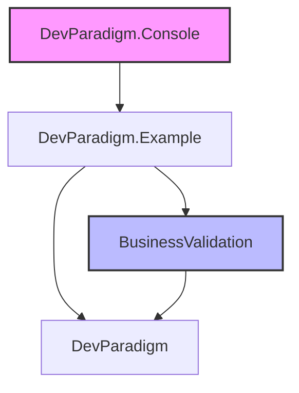

# DevParadigm 项目结构总览

## 📋 项目概览

DevParadigm 是一个采用 C# + F# 混合编程的现代化 .NET 企业级开发框架。项目巧妙地结合了面向对象和函数式编程的优势，为复杂的业务场景提供了一套完整的解决方案。

### 🏗️ 项目组成

解决方案包含 **4 个核心项目**：

```
DevParadigm 解决方案结构
├── DevParadigm/                    # 核心框架层 (C#)
│   ├── Basement/                  # 基础抽象层
│   ├── Common/                    # 通用组件
│   └── Handlers/                  # 业务处理器基类
│
├── BusinessValidation/            # 业务验证层 (F#)
│   ├── Validation.Core/          # 验证核心类型
│   ├── ValidatorCombinators.fs   # 验证器组合子
│   └── FunctionalAdapter.fs     # C# 互操作适配器
│
├── DevParadigm.Example/          # 领域示例层 (C#)
│   ├── Handlers/                 # 示例业务处理器
│   ├── BusinessRules/            # 业务规则实现
│   ├── Repositories/             # 数据访问实现
│   ├── Entities/                 # 领域实体
│   └── DTOs/                     # 数据传输对象
│
└── DevParadigm.Console/          # 控制台应用 (C#)
    ├── Program.cs                # 应用入口
    └── DependencyInjection/      # 依赖注入配置
```

## 🎯 核心架构设计

### 1. 分层架构

```
┌─────────────────────────────────────────────┐
│         应用层 (Application)                │
│    DevParadigm.Console / Web APIs          │
├─────────────────────────────────────────────┤
│         示例层 (Example)                   │
│    DevParadigm.Example (业务场景示例)       │
├─────────────────────────────────────────────┤
│         业务层 (Business)                   │
│  BaseBusinessHandler / BusinessRules       │
├─────────────────────────────────────────────┤
│       验证层 (Validation)                  │
│    BusinessValidation (F# 函数式验证)       │
├─────────────────────────────────────────────┤
│         核心层 (Core)                      │
│    DevParadigm (框架基础设施)               │
├─────────────────────────────────────────────┤
│         数据层 (Data)                      │
│   EF Core / Repositories / DbContext       │
└─────────────────────────────────────────────┘
```

### 2. 依赖关系



## 🔧 技术栈详情

### DevParadigm - 核心框架层
- **.NET 9.0** (C# 13)
- **Entity Framework Core 9**
- **依赖注入容器**
- **异步编程支持**

### BusinessValidation - F# 验证层
- **F# 8**
- **函数式编程范式**
- **组合子模式**
- **类型安全验证**

### DevParadigm.Example - 示例实现
- **读写分离架构**
- **仓储模式实现**
- **事务管理**
- **业务规则引擎**

## 💡 设计亮点

### 1. 混合语言编程
- **C# 负责**：面向对象的基础设施、业务流程编排
- **F# 负责**：函数式验证逻辑、不可变数据结构
- **无缝集成**：通过适配器模式实现两种语言的互操作

### 2. 验证体系创新
```csharp
// C# 端调用
var validationResult = await BusinessValidation
    .OrderValidation
    .validateOrderAll(input, unit);
```

```fsharp
// F# 端实现
let validateOrderAll = all [
    validateCustomerId
    validateProductItems
    validateStock
    validateDailyOrderLimit
]
```

### 3. 业务处理器模式
`BaseBusinessHandler<TInput, TEntity, TOutput, TKey>` 提供了完整的业务处理流程：
1. 输入校验 → 2. 业务规则验证 → 3. 实体构建 → 4. 事务处理 → 5. 结果返回

### 4. 读写分离实现
- **WriteDbContext**：处理写操作和实时查询
- **ReadDbContext**：处理只读查询，提升性能
- **动态切换**：通过 `useMaster` 参数灵活选择数据源

## 📁 详细目录结构

### DevParadigm 项目
```
DevParadigm/
├── Basement/
│   ├── UserInfo.cs                    # 用户信息抽象
│   ├── BusinessUnit.cs                # 业务上下文单元
│   └── IBusinessHandler.cs            # 业务处理器接口
│
├── Common/
│   ├── Validation/
│   │   ├── ValidationLevel.cs         # 校验级别枚举
│   │   ├── ValidationResult.cs        # 校验结果类型
│   │   └── GradedValidationAttribute.cs # 分级校验特性
│   │
│   ├── Results/
│   │   ├── ApiResult.cs               # API 统一返回类型
│   │   └── PagedList.cs               # 分页结果
│   │
│   └── Extensions/
│       └── ServiceCollectionExtensions.cs # DI 扩展
│
└── Handlers/
    ├── BaseBusinessHandler.cs         # 业务处理器基类
    └── ITransactionManager.cs         # 事务管理接口
```

### BusinessValidation 项目
```
BusinessValidation/
├── Types.fs                           # 核心类型定义
│   ├── ValidationResult              # 验证结果类型
│   └── Validator                      # 验证器类型
│
├── ValidatorCombinators.fs            # 验证器组合子
│   ├── all                           # 组合多个验证器
│   ├── when'                         # 条件验证
│   └── validateAsync                 # 异步验证包装
│
├── FunctionalAdapter.fs               # C# 互操作适配器
├── Validation.fs                      # 验证模块入口
│
└── Examples/
    └── OrderValidation.fs             # 订单验证示例
        ├── validateCustomerId
        ├── validateProductItems
        ├── validateStock
        └── validateDailyOrderLimit
```

### DevParadigm.Example 项目
```
DevParadigm.Example/
├── Handlers/
│   ├── CreateOrderHandler.cs          # 订单创建处理器
│   └── BaseBusinessHandler.cs         # 框架基类引用
│
├── BusinessRules/
│   └── OrderCreationBusinessRule.cs   # 订单创建业务规则
│
├── Repositories/
│   ├── IOrderRepository.cs            # 订单仓储接口
│   ├── OrderRepository.cs             # 订单仓储实现
│   ├── IStockRepository.cs            # 库存仓储接口
│   └── StockRepository.cs             # 库存仓储实现
│
├── Entities/
│   ├── Order.cs                       # 订单实体
│   ├── Stock.cs                       # 库存实体
│   └── UserOrderCount.cs              # 用户订单计数实体
│
├── DTOs/
│   ├── CreateOrderInput.cs            # 创建订单输入
│   └── CreateOrderOutput.cs           # 创建订单输出
│
└── Data/
    ├── WriteDbContext.cs              # 写库上下文
    └── ReadDbContext.cs               # 读库上下文
```

### DevParadigm.Console 项目
```
DevParadigm.Console/
├── Program.cs                         # 程序入口
├── DependencyInjection/
│   └── ServiceCollectionExtensions.cs # DI 配置
└── appsettings.json                   # 配置文件
```

## 🚀 快速导航

### 学习路径

1. **初学者**：
   - 阅读 [DevParadigm 核心框架文档](./DevParadigm-Core.md)
   - 查看 [Interface 接口契约层](./Interface-Contracts.md)
   - 运行 Console 示例

2. **进阶开发者**：
   - 学习 [BusinessValidation F# 验证库](./BusinessValidation-FSharp.md)
   - 理解 [Infrastructure.Data 数据层](./Infrastructure-Data.md)
   - 探索读写分离实现

3. **架构师**：
   - 研究混合语言架构设计
   - 分析函数式编程在业务验证中的应用
   - 考虑 CQRS 和领域事件集成

### 关键文件索引

| 功能 | 文件路径 | 作用 |
|------|---------|------|
| **业务处理器基类** | DevParadigm/Handlers/BaseBusinessHandler.cs | 定义标准业务流程 |
| **F# 验证组合子** | BusinessValidation/ValidatorCombinators.fs | 函数式验证组合 |
| **订单示例** | DevParadigm.Example/Handlers/CreateOrderHandler.cs | 完整业务示例 |
| **读写分离** | DevParadigm.Example/Data/WriteDbContext.cs | 数据访问实现 |

## 🎯 特色功能

### 1. 分级验证机制
```csharp
public enum ValidationLevel
{
    Mandatory = 1,      // 必须通过，失败则终止
    Graded = 2,         // 分级验证，可配置处理策略
    NonMandatory = 3    // 非强制，可弹窗确认
}
```

### 2. 事务自动管理
```csharp
// 自动事务处理
protected async Task<TResult> ExecuteInTransactionAsync<TResult>(
    Func<Task<TResult>> operation
)
```

### 3. 性能优化特性
- 默认 `AsNoTracking()` 查询
- 批量操作支持
- 连接池优化
- 查询缓存机制

## 🔮 发展规划

### 短期目标
- [ ] 添加更多业务场景示例
- [ ] 完善单元测试覆盖率
- [ ] 优化性能监控工具

### 长期规划
- [ ] 支持领域事件（Domain Events）
- [ ] 引入 CQRS 模式
- [ ] 添加分布式事务支持
- [ ] 集成消息队列

## 💬 总结

DevParadigm 通过创新的混合语言架构，为企业级应用开发提供了：

- **类型安全**：F# 的函数式验证确保编译时错误检查
- **开发效率**：C# 的成熟生态和工具链
- **可维护性**：清晰的分层架构和职责分离
- **高性能**：读写分离和异步优化
- **可扩展性**：插件化的验证和业务规则系统

这个框架特别适合复杂的业务系统，尤其是那些有大量验证规则的业务场景。通过函数式编程的优势，可以让验证逻辑更加清晰、可靠和易于维护。